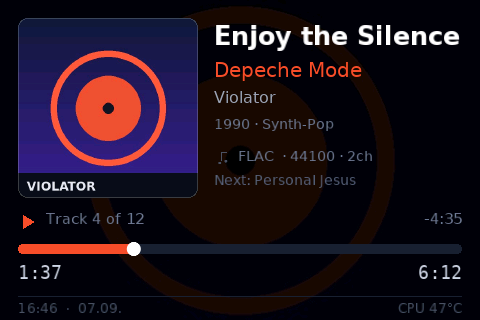
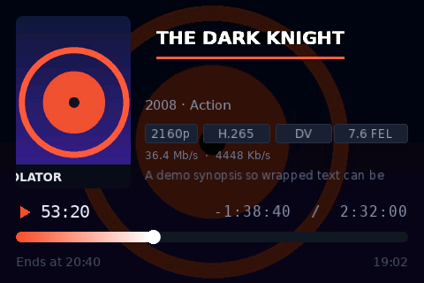
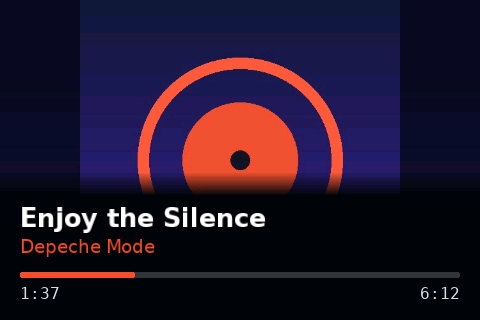
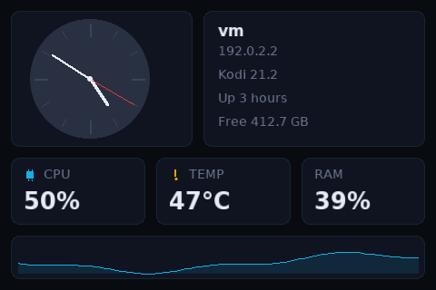

# LCD4Linux for CoreELEC / Kodi

Shows what Kodi is playing on a small USB display — title, artist, cover art,
a progress bar with elapsed and remaining time, plus a clock, CPU load,
temperature and anything else Kodi knows. Every pixel on screen is described
by a JSON layout file, so it can be rearranged freely.






## Will it work with my display?

Three kinds of output, selected under *Settings → Display → Connection*:

| | Hardware | Resolution |
|---|---|---|
| **AX206** | 3.5" USB panels with the AX206 controller — sold as AIDA64 displays, "SmartDisplay" or "USB Mini Screen", known from [dpf-ax](http://dpf-ax.sourceforge.net/) and [lcd4linux](https://lcd4linux.bulix.org/). Needs the dpf-ax firmware (`1908:0102`) | 480×320 |
| **Samsung SPF** | The photo frames — SPF-72H, SPF-87H, SPF-107H and relatives — in their "mini monitor" mode | 800×480 … 1024×600 |
| **Network display** | No USB panel at all: any browser in full screen, typically an old tablet on the wall | your choice |

Wiring, mode switching and the tablet setup are in **[docs/SETUP.md](docs/SETUP.md)**.

## Install

1. Download the repository as a ZIP (`Code → Download ZIP`) or grab a release.
   The folder inside the ZIP must be named `script.lcd4linux`.
2. Kodi → *Add-ons* → *Install from zip file* → pick the ZIP.
3. Plug in the display. The service starts on its own and looks for it.
4. *Add-ons → Program add-ons → LCD4Linux* opens the menu: choose a layout,
   show a test pattern, check the status, open the settings.

Straight onto the box instead:

```sh
cd /storage/.kodi/addons
git clone https://github.com/CE-Repo/script.lcd4linux.git
systemctl restart kodi
```

An AX206 panel should light up immediately. For a Samsung frame, set
*Display type* to **Samsung SPF photo frame** and choose *Reload service*.

## What it does

* **No dependencies.** USB access is `libusb` through ctypes; the PNG and JPEG
  decoders, the JPEG encoder the Samsung frames need, and the font renderer
  are all part of the add-on. No `pyusb`, no Pillow, no compiler. Pillow is
  picked up if `script.module.pillow` happens to be installed, which makes
  decoding large fanart much cheaper, but nothing depends on it.
* **Sends only what changed.** On the AX206 a ticking seconds hand costs a few
  hundred bytes instead of 300 kB per frame; on the Samsung, which accepts
  complete JPEGs only, just the changed block rows are re-encoded.
* **30 bundled fonts** — text, narrow, display and seventeen monospaced
  families, every one of them drawing the same characters, and every
  monospaced one keeping a single cell width so figures line up. The editor
  shows them all side by side as real samples, so a font can be compared
  before it is picked.
* **20 bundled layouts**, each in 480×320, 800×480 and 1024×600 plus portrait.
  You pick the name, the add-on picks the size that fits the attached panel.
* **A layout editor in the browser** at `http://<box>:8050/` — drag elements
  around, with a preview drawn by the same renderer that feeds the display.
  Pick several at once to recolour or realign them in one go, copy them into
  another layout with `Ctrl+C` / `Ctrl+V`, and drag the layer list to reorder.
* **Every Font Awesome Free icon**, about two thousand of them, picked from a
  dialog with a search box. Each one is fetched once and then kept in the
  add-on's own cache, so a box with no internet connection still draws them;
  the whole set can be cached up front in three requests.
* **Every Kodi InfoLabel** is available (`${info:MusicPlayer.Album}`), as is
  every Kodi condition (`Player.HasVideo`).
* **Words that know when to leave.** `{Track ${player.track}}` writes the
  caption only while there is a number, so nothing is left standing on the
  panel once the value behind it is gone.
* **Media details in plain words.** Kodi reports `hevc`, `truehd_atmos` and
  `8`; the display shows H.265, Dolby TrueHD Atmos and 7.1, along with the
  dynamic range (Dolby Vision, HDR10+, HDR10, HLG, SDR) and a resolution that
  really reads `2160p` rather than `4K`, the live video and audio bitrate, and
  the clearlogo of the film, the series or the artist. On CoreELEC, with the
  optional `script.module.sidedata` installed, also the Dolby Vision profile
  and its enhancement layer: `Dolby Vision Profile 7.6 FEL`. The tables follow
  [TinyPPI](https://github.com/CE-Repo/script.tinyppi), so a box running both
  add-ons names the same film the same way.
* **Multiple pages** with conditions and automatic rotation — music, video,
  clock and system pages that appear when they are relevant.
* **English and German** on the display, following Kodi's own language.
* **Works without hardware**: render any layout to PNG on a PC.

## Documentation

| | |
|---|---|
| **[docs/SETUP.md](docs/SETUP.md)** | Connecting an AX206 panel, a Samsung frame or a browser/tablet. Includes powering a Samsung frame on and off, which USB cannot do by itself |
| **[docs/SETTINGS.md](docs/SETTINGS.md)** | Every setting, the actions you can bind to a key, and troubleshooting |
| **[docs/LAYOUT.md](docs/LAYOUT.md)** | The bundled layouts, the browser editor, and the full reference for writing your own |

## Tools

All of these run on a plain PC with Python 3, no Kodi needed:

```sh
python3 tools/preview.py --out preview.png        # render a layout to PNG
python3 tools/webeditor.py                        # the layout editor, standalone
python3 tools/scale_layout.py mine.json 1024 600  # convert to another size
python3 tools/selftest.py                         # check fonts, decoders, layouts
```

`tools/contact_sheet.py` builds the overview images, `tools/make_thumbs.py` the
pictures for the layout chooser, `tools/mkicons.py` rebuilds the Font Awesome
index, and `tools/mkfont.py` regenerates the fonts (the only one that needs
Pillow).

## Licence

MIT — see [LICENSE](LICENSE).

The bundled fonts come from the [DejaVu fonts](https://dejavu-fonts.github.io/)
(Bitstream Vera licence), see
[resources/fonts/LICENSE-DejaVu.txt](resources/fonts/LICENSE-DejaVu.txt).

The `icon` widget can draw the [Font Awesome Free](https://fontawesome.com/)
set; the icons are licensed under CC BY 4.0, see
[resources/icons/LICENSE-FontAwesome.txt](resources/icons/LICENSE-FontAwesome.txt).
The add-on bundles only the index of names in
`resources/icons/fontawesome.json` (rebuilt with `tools/mkicons.py`) and
fetches the outlines it needs into `<addon data>/icons/`.

The AX206 protocol follows the `dpf-ax` project and the AX206 driver of
`lcd4linux` (`drv_dpf.c`). The Samsung SPF protocol follows lcd4linux's
`drv_SamsungSPF.c`, which builds on `playusb` by Andre Puschmann and the work
of Grace Woo.
