# LCD4Linux for CoreELEC / Kodi

A Kodi add-on for two families of USB display:

* the 3.5" panels built around the **AX206** controller (480×320) — sold as
  **AIDA64 displays**, "SmartDisplay" or "USB Mini Screen", and known from the
  [dpf-ax](http://dpf-ax.sourceforge.net/) and
  [lcd4linux](https://lcd4linux.bulix.org/) projects;
* the **Samsung SPF photo frames** (SPF-72H, SPF-87H, SPF-107H and relatives,
  800×480 up to 1024×600) in their "mini monitor" mode.

No USB panel? It works without one: as a **network display** the add-on serves
its frames to any browser in full screen — typically an old tablet on the wall.

The add-on shows what Kodi is playing — title, artist, album, cover art, a
progress bar with elapsed and remaining time — plus a clock, CPU load,
temperature, library counts and anything else Kodi knows.
**Everything on screen is described by JSON layout files** and can be changed
freely.


And on the 800×480 frame:

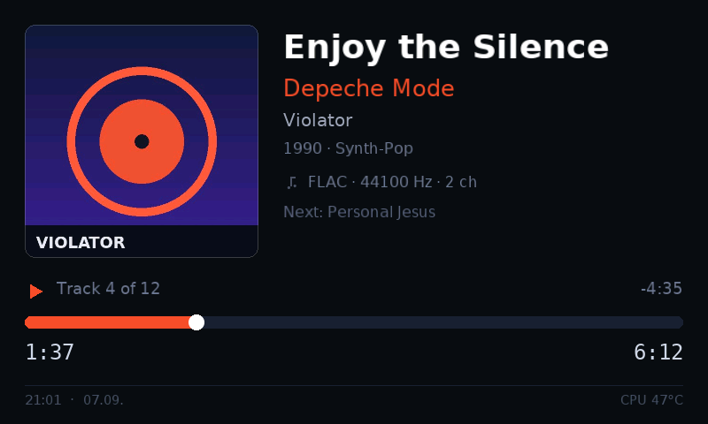
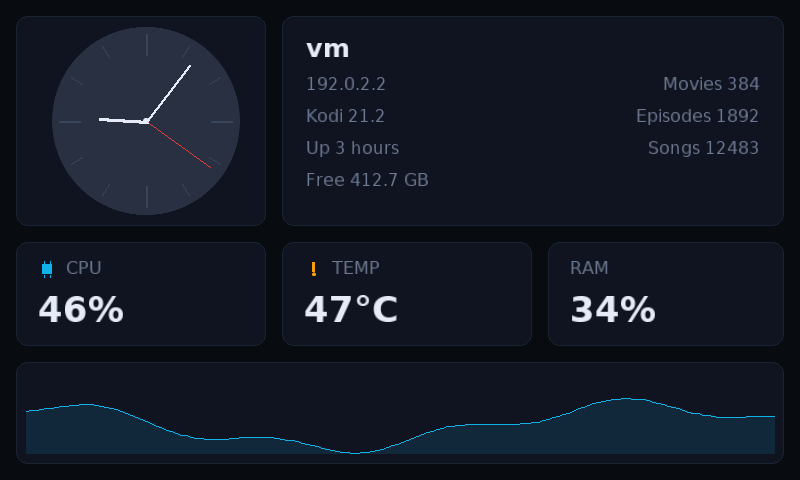

---

## Features

* **Direct USB access** through `libusb` (ctypes) — no extra Python modules,
  no `pyusb`, no compiler needed.
* **Only changed areas are transferred.** On the AX206 a ticking seconds hand
  costs a few hundred bytes instead of 300 kB per frame; on the Samsung only
  the JPEG block rows that changed are re-encoded.
* **Fully customisable layouts** as JSON: pages, widgets, positions, colours,
  font sizes, conditions and data sources.
* **Every layout in three sizes** — 480×320, 800×480 and 1024×600 — plus
  portrait. The setting stores the name only; the add-on automatically picks
  the variant that fits the attached panel.
* **Layout editor in the browser**: place, drag and resize elements with the
  mouse, with a preview drawn by the same renderer that feeds the display —
  from a phone, tablet or PC on the network.
* **All Kodi InfoLabels** can be used (`${info:MusicPlayer.Album}`), as can
  all Kodi conditions (`Player.HasVideo`).
* **Media details in plain words**: Kodi reports `hevc`, `truehd_atmos` and
  `8` — the display shows H.265, Dolby TrueHD Atmos and 7.1, alongside the
  dynamic range (Dolby Vision, HDR10+, HDR10, HLG, SDR) and a resolution that
  really reads `2160p` rather than `4K`. The tables follow
  [TinyPPI](https://github.com/CE-Repo/script.tinyppi), so a box running both
  add-ons names the same film the same way.
* **Multiple pages** with conditions and automatic rotation (a music page, a
  video page, a clock page, a system page and so on).
* **Widgets**: text (with marquee, wrapping, shadow), progress bar
  (solid/segmented, horizontal/vertical, with knob), history graph,
  rectangle, line, circle, image, icon, analogue clock.
* **Cover art and fanart** are displayed — PNG and JPEG decoders are part of
  the add-on and run without Pillow or ffmpeg.
* **Anti-aliased fonts** (DejaVu, pre-rendered) in every size.
* **Rotation** by 0/90/180/270 degrees, mirroring, selectable byte order.
* **Backlight dims** while nothing is playing — on the AX206 through the
  backlight itself, on the Samsung frame in software.
* **English and German on the display**: the bundled layouts, the page names
  and the names of weekdays and months follow Kodi's language. Custom layouts
  can do the same with `$LOCALIZE[...]`.
* **Network display**: instead of a USB panel, any device with a browser can
  show the picture — as an MJPEG stream in a plain `` that even works on
  an Android 4.4 tablet.
* **Preview without hardware**: layouts can be rendered to PNG.

---

## Installation

1. Download the repository as a ZIP (`Code → Download ZIP`) or use a release.
   The folder inside the ZIP must be named `script.lcd4linux`.
2. Kodi → *Add-ons* → *Install from zip file* → pick the ZIP.
3. Plug in the display. The service starts automatically and looks for the panel.
4. *Add-ons → Program add-ons → LCD4Linux* opens the menu (choose layout, test
   pattern, status, settings).

Or copy it straight onto the box:

```sh
cd /storage/.kodi/addons
git clone https://github.com/CE-Repo/script.lcd4linux.git
systemctl restart kodi
```

### Supported hardware

The **display type** is chosen in the settings — the two families speak
completely different protocols.

#### AX206 (AIDA64 type)

| | |
|---|---|
| Controller | AX206 (with dpf-ax firmware) |
| USB ID | `1908:0102` |
| Resolution | reported by the display, typically 480×320 |
| Transfer | raw RGB565 pixels, changed rectangle only |
| Brightness | 8 levels, controlled by the add-on |

```sh
lsusb | grep 1908
```

#### Samsung SPF

| | |
|---|---|
| Models | SPF-72H, SPF-75H/76H, SPF-83H/83M, SPF-85H/85P, SPF-86H/86P, SPF-87H, SPF-105P, SPF-107H, SPF-700T, SPF-800P, SPF-1000P |
| USB ID | `04e8:200a` (mass storage) → `04e8:200b` (monitor), depending on the model |
| Resolution | 800×480 (SPF-72H), 800×600 or 1024×600 depending on the model |
| Transfer | a complete JPEG per frame, no partial updates possible |
| Brightness | **not** controllable over USB — the add-on darkens the picture instead |

```sh
lsusb | grep 04e8
```

The frame first appears as a USB mass storage device. The add-on sends the
mode-switch request itself; the frame then briefly disappears from the bus and
comes back with a new product ID in monitor mode. That takes one to three
seconds and happens on every power-up. `usb_modeswitch` is not needed.

Box and frame are usually switched on together, and the frame needs about half
a minute longer than Kodi. While it is still booting it is either not on the
bus at all, or it answers the mode switch and still comes back as a USB drive.
The service therefore starts even without a display, looks for it every few
seconds during the first minutes (see *Start-up grace period*), repeats the
mode-switch request for as long as the frame reports itself as a drive, and
rebuilds the layout and frame size as soon as the frame reports its real
resolution. Restarting the service by hand is no longer necessary.

##### Connecting it step by step

1. **Connect the frame's power supply.** A 7" frame draws more current than a
   USB port is allowed to deliver — the supplied power adapter is mandatory,
   the frame will not run off the USB cable alone.
2. **Plug the USB cable into the frame's *upstream* port** (the manual calls it
   the "up stream terminal", the port for the PC connection). Next to it the
   frame has a USB host port for memory sticks — that one does not work for
   this. Preferably use the cable that came with the frame.
3. **Plug the other end into a USB 2.0 port on the CoreELEC box.** Avoid a USB
   hub in between if you can.
4. **Switch the frame on.** If it asks on screen for the operating mode
   ("Mass Storage" / "Mini Monitor" / slideshow), pick **Mini Monitor** once.
   If it does not ask, the add-on performs the switch itself.
5. Check on the box:

   ```sh
   lsusb | grep 04e8
   ```

   `04e8:200a` = mass storage mode (not switched yet),
   `04e8:200b` = monitor mode (done). The add-on menu shows the same thing in
   plain words under *Display status*.
6. In the add-on: *Settings → Display → Connection → Display type* to
   **Samsung SPF photo frame**, then *Reload service*.

##### Switching it on and off with CoreELEC

An honest note first: **the mini monitor protocol has no command for
brightness or for switching off.** The frame only accepts pictures. What the
add-on can and cannot do:

| | |
|---|---|
| When Kodi starts | The frame is switched into monitor mode and the picture appears — automatically |
| Brightness | The add-on darkens the **picture** (settings *Brightness (software)* and *Idle brightness (software)*). The backlight itself is untouched |
| On shutdown | The add-on shows a **black picture** (setting *Clear the display when Kodi stops*). The backlight stays on |
| After that | Without the keep-alive, the frame falls back into its own slideshow after a while |
| Really off | Only by **cutting the power** — no USB command can do this |

For "really off", plug the frame's power supply into a switchable socket and
let the add-on switch it along. That is what *Settings → Behaviour → Power
hooks* is for:

| Setting | When it runs |
|---|---|
| Command when the service starts | runs **before** the display is opened — so use it to switch on |
| Command when the service stops | runs **after** the USB connection has been released — so use it to switch off |

Examples, depending on your socket:

```sh
# Tasmota / Shelly over HTTP
curl -s "http://192.168.1.50/cm?cmnd=Power%20On"
curl -s "http://192.168.1.50/cm?cmnd=Power%20Off"

# Home Assistant
curl -s -X POST -H "Authorization: Bearer TOKEN" \
     -H "Content-Type: application/json" \
     -d '{"entity_id":"switch.photo_frame"}' \
     http://192.168.1.10:8123/api/services/switch/turn_on

# MQTT
mosquitto_pub -h 192.168.1.10 -t cmnd/frame/POWER -m ON
```

Two things to keep in mind:

* After being switched on, the frame needs a few seconds to appear on the USB
  bus. That is not a problem — the add-on looks for it again every
  *Reconnect interval* (20 s by default) and connects on its own. If you want
  it faster, set the value to 5 s.
* Whether the frame powers up by itself after the socket comes back on, or
  needs a button press, depends on the device — try it once. Many SPF models
  switch on automatically when power is applied; some also have an auto
  on/off schedule in their own menu.

Without a switchable socket the compromise is: enable *Dim while idle* and set
*Idle brightness (software)* to 0% — the frame then shows a black picture
instead of dropping into its slideshow, for as long as the box is running.

Kodi runs as `root` on CoreELEC, so no extra udev rules are needed for either
display. If a kernel driver is attached to the device, the add-on detaches it.

#### Network display (browser or tablet)

Instead of a USB panel, the add-on can serve its frames over its own web
interface. At the other end is a browser in full screen — typically an old
Android tablet on the wall.

| | |
|---|---|
| Hardware | anything with a browser: tablet, phone, old laptop, second monitor |
| Resolution | freely selectable under *Display → Picture* (width/height) |
| Transfer | MJPEG over HTTP; a complete JPEG per frame, internally only the changed block rows are re-encoded |
| Brightness | in software, the picture is darkened before it is sent |

To enable it, set *Settings → Display → Connection → Output* to **Network
display (browser or tablet)**. In this mode the HTTP server always runs,
regardless of the switch for the layout editor — here it *is* the display.

The address for the tablet is shown in the add-on menu under *Display status*
and *Web editor*:

```
http://<box>:8050/display
```

If a web interface password is set, it is appended to the address as
`?key=<password>`. That is deliberate: a kiosk browser cannot answer a Basic
auth challenge for an ``. The layout editor itself stays protected by
Basic auth.

| Address | What it serves |
|---|---|
| `/display` | the full-screen page for the tablet |
| `/display?fit=fill` | the same, stretched across the whole screen instead of letterboxed |
| `/display/stream` | the raw MJPEG stream |
| `/display/frame.jpg` | the current frame as a single file |

The page is deliberately tiny: an `` fed by a
`multipart/x-mixed-replace` stream, with no WebSocket and no canvas. That is
exactly why it runs on the ancient WebKit of an Android 4.4 tablet. The
little JavaScript there is only reconnects when the box restarts — without
JavaScript the page still shows pictures.

**Bandwidth:** 800×480 at quality 85 is roughly 28 kB per frame. Idling at one
frame per second, that is about 0.2 Mbit/s.

**Resolution and layouts:** the bundled layouts come in 480×320, 800×480 and
1024×600. A 10" tablet running 1280×800 can either be set to one of those
sizes — the browser then scales up and every layout fits straight away — or
render natively, in which case `tools/scale_layout.py` converts the layouts.

##### Setting up the tablet

An Android tablet **cannot** be booted remotely; auto-boot on the charger
needs root and does not work on every device. The usual approach is therefore:
the tablet stays on, only the **screen** goes on and off.

1. Install a kiosk browser on the tablet, for example *Fully Kiosk Browser*
   (Android 4.4 and up) or the open source *WallPanel*.
2. Enter the `/display` address from above as the start page.
3. In the kiosk browser, enable *keep screen on* and switch off the screensaver.
4. In Kodi, under *Settings → Behaviour → Power hooks*, enter:

```sh
# Command when the service starts - screen on
curl -s --max-time 3 "http://192.168.1.60:2323/?cmd=screenOn&password=SECRET"

# Command when the service stops - screen off
curl -s --max-time 3 "http://192.168.1.60:2323/?cmd=screenOff&password=SECRET"
```

The `--max-time` matters: the start command runs **before** the display is
opened and would otherwise hold up the service start until the *Command
timeout* (15 s by default) if the tablet happens to be off the Wi-Fi.

If the tablet should carry on at normal brightness while idle instead of
dimming, switch off *Dim while idle* or set *Idle brightness (software)* to
100%.

When Kodi shuts down, the add-on sends one more black picture (*Clear the
display when Kodi stops*) before the power hook switches the screen off — so a
browser that stays open does not freeze on the last frame.

**On continuous operation:** old Li-ion batteries like to swell up on a
permanent charger. With permanently mounted tablets, check the back now and
then.

---

## Settings

**Display → Connection**

| Setting | Meaning |
|---|---|
| Display type | `AX206 USB LCD (AIDA64 type)` or `Samsung SPF photo frame`. The dialog shows the matching options for whichever is selected |
| Output | `USB display`, `Network display (browser or tablet)`, `Preview file only` (writes `preview.png` into the add-on data folder) or `Disabled` |
| USB device IDs | `1908:0102` by default, several separated by commas (AX206 only) |
| Display number | when several panels are connected |
| Reset USB device when connecting | helps when another program left the display in a bad state (AX206 only) |
| Reconnect interval | how long to wait before looking for the display again after it disappeared |
| Start-up grace period | how long after the service starts the display is looked for every few seconds, 180 s by default. Meant for displays that boot slower than Kodi — a Samsung frame needs about half a minute. No warning about a missing display appears during this time |

**Display → Samsung photo frame**

| Setting | Meaning |
|---|---|
| Samsung model | `Automatic` takes the frame it finds; otherwise pick a model such as `SPF-72H` (only needed when several frames are connected) |
| JPEG quality | 40–100, 85 by default. Lower = faster and less data |
| Reduced colour resolution (4:2:0) | on: faster and smaller; off: sharper coloured text, about twice the encoding time |

**Display → Picture**

| Setting | Meaning |
|---|---|
| Rotation | 0/90/180/270 degrees, for portrait mounting |
| Mirror horizontally | for mirrored mounting |
| Pixel byte order | if the colours are wrong — see *Troubleshooting* (AX206 only) |
| Override display size | only needed when the panel reports a wrong resolution. In network mode width and height are always adjustable — nothing reports a size there |

**Display → Backlight**

| Setting | Meaning |
|---|---|
| Brightness | AX206: backlight level 0–7 |
| Brightness (software) | Samsung and network display: 10–100%, the picture is darkened before it is sent |
| Dim while idle | dims as soon as nothing is playing; paused playback still counts as playing |
| Idle brightness | AX206: level 0–7 while nothing is playing |
| Idle brightness (software) | Samsung and network display: 0–100%, 0% shows a black picture |
| Clear the display when Kodi stops | black picture on shutdown |

Only the pair that matches the selected *Display type* is ever visible.
Samsung frames have no brightness control over USB — there the picture, not
the backlight, is darkened. That costs no extra CPU time, because the
darkening lives in the JPEG encoder's colour tables.

**Layout**

Active layout, layout chooser, user layout folder, page interval, and the
action buttons *Preview current layout*, *Show test pattern*, *Display status*
and *Reload service*.

*Choose layout…* opens a list with a preview image per design; the settings
stay open and the chosen layout appears in the line above afterwards. The
images ship as `resources/thumbs/<design>.png`. Layouts from the user folder
have no bundled image — they are rendered once when the list is first opened
and cached in `<addon data>/thumbs/`. Several sizes of the same design
(`default.json`, `default-800x480.json` and `default-1024x600.json`) appear as
a single entry, because loading picks the variant that fits the panel anyway.

**Layout → Web editor**

| Setting | Meaning |
|---|---|
| Layout editor in the browser | switches the web server on and off (default: on) |
| Open the web editor | shows the address the editor is reachable at |
| Port | 8050 by default |
| Reachable from | `the whole network` or `this box only` (then only from a browser on the box itself) |
| Password | empty = no prompt; otherwise the browser asks for it, any user name is accepted |

**Language**

There is nothing to set: the add-on follows Kodi's language. The settings, the
messages on the display, the bundled layouts and the names of weekdays and
months are available in English and German. How custom layouts can follow
along is described in [docs/LAYOUT.en.md](docs/LAYOUT.en.md) under
*Translating fixed words*.

**Behaviour**

Frame rate while playing and while idle, smooth image scaling, Kodi
notifications on the display, debug logging, and the **power hooks** that run
an arbitrary shell command when the service starts and stops (see *Switching
it on and off with CoreELEC*).

---

## All layouts at a glance

Every template in three states — exactly as the add-on picks them itself:

**Video playing**

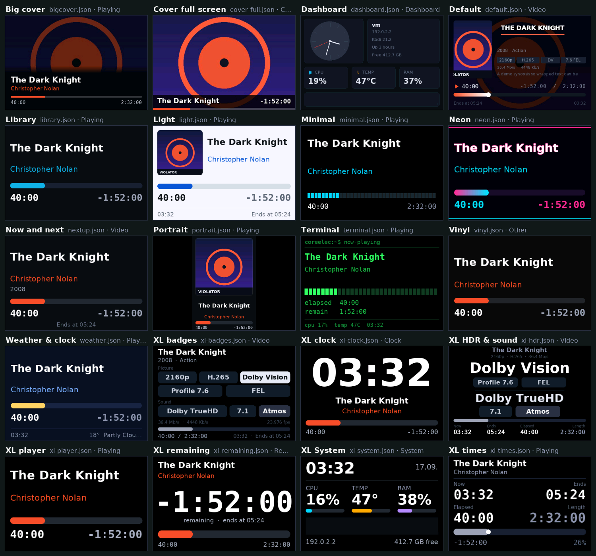

**Music playing**

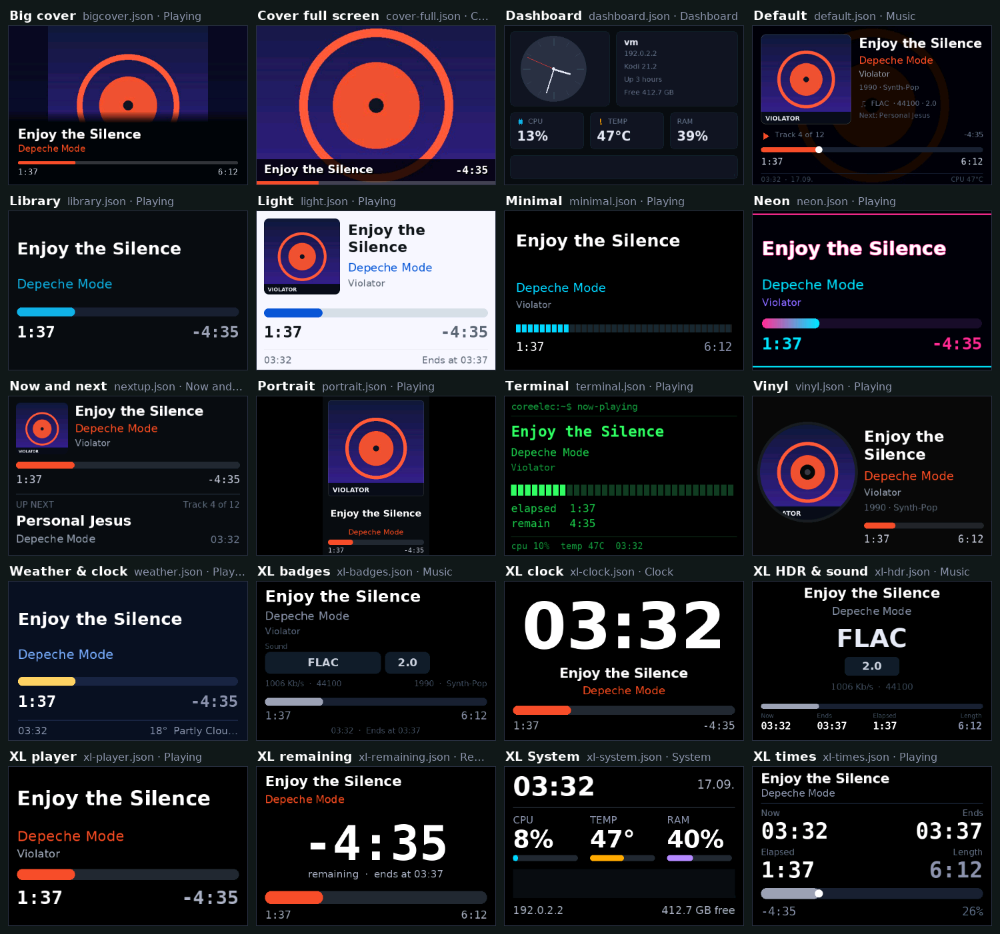

**Nothing playing**

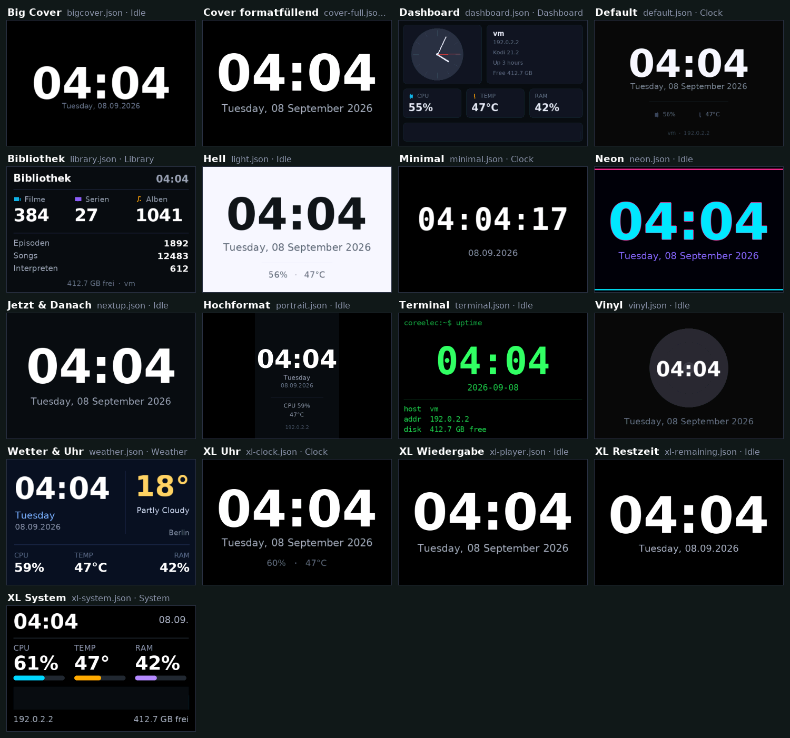

The overviews can be regenerated with

```sh
python3 tools/contact_sheet.py --state video --out overview.png
# --state: video | series | normal | music | idle
# --all-sizes also includes the 800x480 and 1024x600 variants
```

## Bundled layouts

Only the name is selected (for example `default.json`) — if the size does not
match, the add-on automatically takes the matching variant, so
`default-800x480.json` on an SPF-87H or `default-1024x600.json` on an
SPF-107H.

**Plenty of detail — for sitting right in front of it**

| File | Description |
|---|---|
| `default.json` | Four pages: music (with cover), video (with poster), clock, system values |
| `bigcover.json` | Full-screen cover with an info bar at the bottom |
| `minimal.json` | Large type, segmented progress bar, no images — very light on CPU |
| `dashboard.json` | Analogue clock, CPU, temperature, RAM and a history graph |

**XL — readable from across the room**

Little content, very large type, pure black background and strong colours. On
a 3.5" display that is the difference between "I would have to get up" and "I
can read it from the sofa".

| File | Description |
|---|---|
| `xl-player.json` | Title in 40 px across two lines, artist/show large below it, a thick bar, times in 38 px |
| `xl-remaining.json` | The **remaining time, huge** (96 px) in the middle of the screen — the one number you actually want during a film — plus end time and bar |
| `xl-clock.json` | Time in 128 px, with date and CPU/temperature while idle, with title and bar below it while playing |
| `xl-system.json` | Large clock, below it CPU, temperature and RAM as three big numbers with bars and a history graph |
| `cover-full.json` | Just the cover, filling the frame, with a slim info bar and progress bar along the bottom |

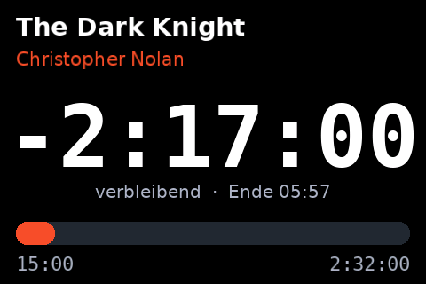
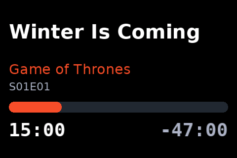
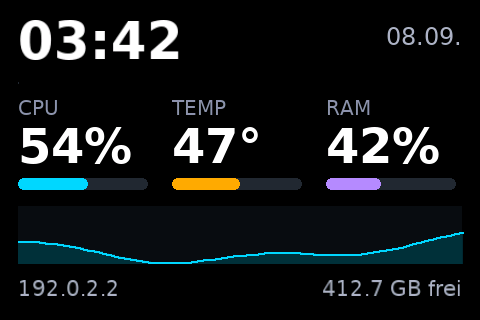
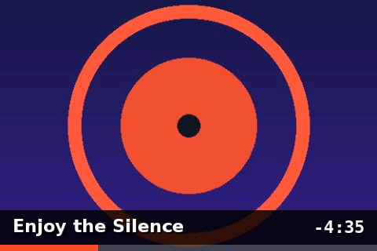

**Styles**

Same information, different look — pick whatever suits the living room.

| File | Description |
|---|---|
| `light.json` | Light theme, dark text on white — considerably nicer in bright rooms and during the day |
| `terminal.json` | Green on black, monospace throughout, segmented bars — console look and very legible |
| `neon.json` | Magenta/cyan with a glowing outline around the text, gradient bars |
| `vinyl.json` | The cover as a round record complete with centre hole, text beside it |

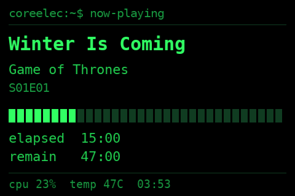
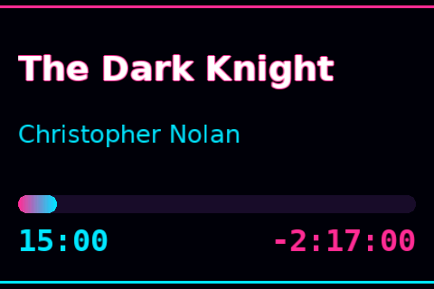
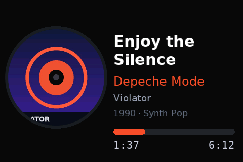
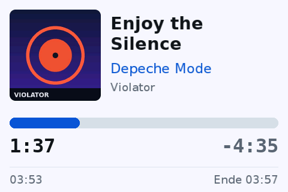

**Different content**

| File | Description |
|---|---|
| `nextup.json` | The current track on top, **what comes next** below — for music playlists |
| `weather.json` | Clock and weather side by side, CPU, temperature and RAM below. The weather page only appears when a weather add-on is configured in Kodi |
| `library.json` | Movies, TV shows and albums as large counters, with episodes, songs and artists below |
| `portrait.json` | **Portrait 320×480** for a display mounted rotated by 90° — cover on top, text below |

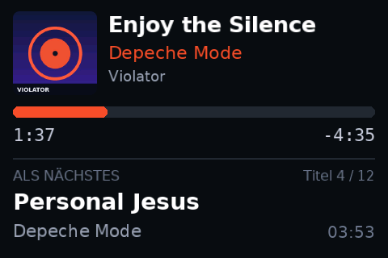
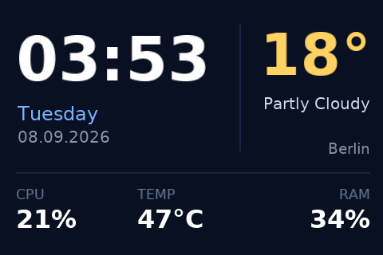
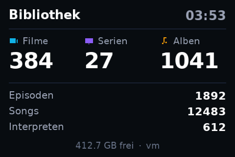

Besides the 480×320 original, every layout comes in an 800×480 and a 1024×600
version with the suffix `-800x480` or `-1024x600` (for portrait,
`portrait-480x800.json` and `portrait-600x1024.json`); the add-on picks the
right one automatically when a matching panel is connected.

For portrait, also set *Settings → Display → Picture → Rotation* to 90 or 270
degrees.

---

## Layout editor in the browser

Layouts can be assembled with the mouse instead of typed as JSON: the service
brings along a small web server that serves an editor.

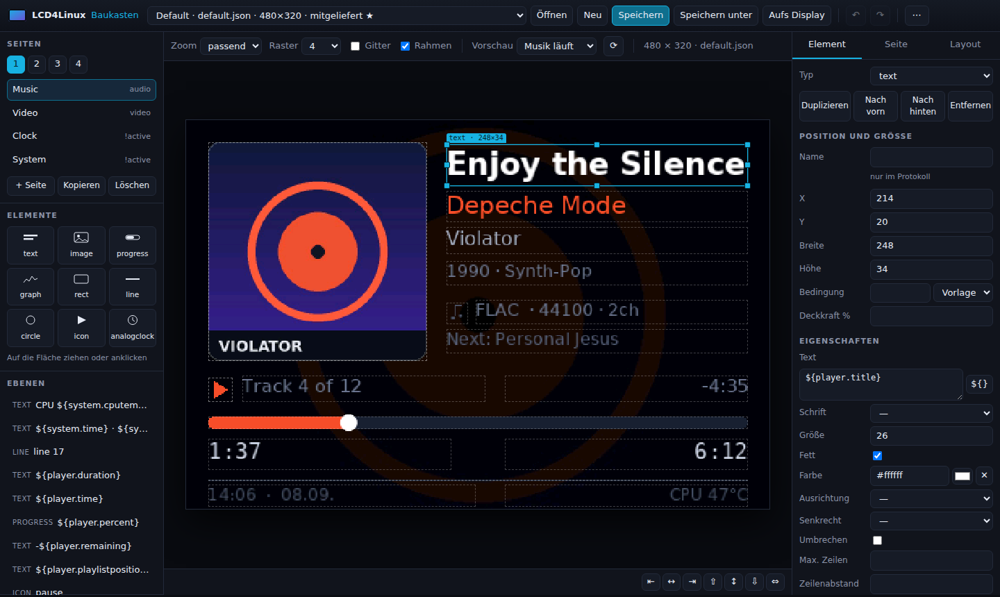

**Opening it**

*Add-ons → LCD4Linux → Web editor* shows the address, usually

```
http://<box-ip>:8050/
```

The address is also in the settings under *Layout → Web editor*. The editor
runs in any current browser, including on a phone or tablet — nothing is
loaded from the internet, it is all part of the add-on.

**What it can do**

* **Pages**: create, copy, reorder and delete — the tabs at the top left are
  the pages of the layout.
* **Elements**: drag them from the palette onto the canvas or click them into
  place: text, image, progress bar, graph, rectangle, line, circle, icon and
  analogue clock.
* **Move and resize** with the mouse, snapping to the grid (hold `Alt` to
  disable snapping, `Shift` to constrain the direction while dragging). Arrow
  keys move by one pixel, with `Shift` in steps of ten.
* **Properties** on the right: every field the renderer knows — colours with a
  colour picker, fonts, alignment, marquee, conditions with templates.
* **Data fields** through the `${}` button: every token with an explanation,
  plus the filters (`|upper`, `|trunc:20`, `|hms` …), inserted at the cursor.
* **Preview**: after every change the add-on renders the picture itself and
  shows it — not a reconstruction in the browser, but exactly what the panel
  will show. Switchable between *music playing*, *video playing*, *paused*,
  *nothing playing* and — on the box — *live data*.
* **Save** into the user layout folder, and *To the display* applies the
  layout to the panel immediately.
* Undo/redo (`Ctrl+Z` / `Ctrl+Y`), duplicate (`Ctrl+D`), save (`Ctrl+S`),
  delete (`Del`), alignment buttons and a JSON editor for the finishing
  touches.

**Where it saves**

It always saves into the user folder
(`.../addon_data/script.lcd4linux/layouts/`). A bundled layout is never
overwritten: your own version takes precedence, and the original comes back as
soon as the copy is deleted.

**Without a box, just on a PC**

```sh
python3 tools/webeditor.py            # http://127.0.0.1:8050/
python3 tools/webeditor.py --bind all --port 8050 --password secret
```

**Security**

The editor may write layout files and reload the service. On a home network
that is the point; on a shared network, *Reachable from* should be set to
**this box only** or a password should be set. Only the files in
`resources/web/` are served, saving only ever goes into the layout folder, and
the server rejects file names containing path components.

---

## Custom layouts

Layouts live in

```
/storage/.kodi/userdata/addon_data/script.lcd4linux/layouts/
```

Files in this folder take precedence over the bundled ones — your own
`default.json` there overrides the template, and an update will not delete it.
On first start the add-on drops `custom.json.example` there as a starting
point: rename it to `mine.json`, adjust it, select it from the menu.

A short example:

```json
{
  "name": "My layout",
  "size": [480, 320],
  "background": "#101317",
  "defaults": {"font": "sans", "size": 18, "color": "#ffffff"},
  "pages": [
    {
      "name": "Playback",
      "condition": "active",
      "widgets": [
        {"type": "text", "x": 20, "y": 24, "w": 440, "h": 40,
         "text": "${player.title}", "size": 30, "bold": true,
         "scroll": "marquee"},
        {"type": "text", "x": 20, "y": 70, "w": 440, "h": 28,
         "text": "${player.artist}", "size": 20, "color": "#17b2e2"},
        {"type": "progress", "x": 20, "y": 260, "w": 440, "h": 12,
         "value": "${player.percent}", "radius": 6, "color": "#17b2e2"},
        {"type": "text", "x": 20, "y": 280, "w": 200, "h": 24,
         "text": "${player.time} / ${player.duration}", "font": "mono"}
      ]
    }
  ]
}
```

The full reference — every widget, property, data field, filter and condition
— is in **[docs/LAYOUT.en.md](docs/LAYOUT.en.md)**
(German: [docs/LAYOUT.de.md](docs/LAYOUT.de.md)).

### Converting a layout to another display size

An existing layout can be scaled instead of being laid out again by hand:

```sh
python3 tools/scale_layout.py mine.json 800 480
# writes mine-800x480.json
```

Positions and boxes follow the two axes separately, while font sizes, radii
and line widths follow the height — that keeps the proportions of the type.
Percentages are left alone, because they are already relative.

One limitation: because the two axes scale differently, a circle becomes an
oval. Layouts with round elements — `vinyl.json`, for instance — need a manual
touch-up afterwards (make the box square again).

### Designing layouts without hardware

On a PC (Python 3 is enough, no Kodi):

```sh
python3 tools/preview.py --layout resources/layouts/default.json --page 0 --out preview.png
python3 tools/preview.py --track 1 --page 1 --out video.png     # video demo data
python3 tools/preview.py --rotate 90 --out portrait.png
```

On the box without a display: set *Output* to **Preview file only** — every
frame then lands as `preview.png` in the add-on data folder. In the menu,
*Preview layout* shows the current layout directly in Kodi.

---

## Controlling it from Kodi

The actions can be bound to keys, favourites or skin buttons:

```
RunScript(script.lcd4linux,next_page)        # next page
RunScript(script.lcd4linux,layout)           # choose layout
RunScript(script.lcd4linux,preview)          # show preview
RunScript(script.lcd4linux,test_pattern)     # test pattern
RunScript(script.lcd4linux,status)           # display status
RunScript(script.lcd4linux,reload)           # reload service
RunScript(script.lcd4linux,brightness_up)    # brighter
RunScript(script.lcd4linux,brightness_down)  # darker
```

Other add-ons can push a message onto the display:

```python
xbmc.executeJSONRPC(json.dumps({
    "jsonrpc": "2.0", "id": 1, "method": "JSONRPC.NotifyAll",
    "params": {"sender": "script.lcd4linux", "message": "message",
               "data": {"heading": "Doorbell", "message": "Someone is here"}}}))
```

---

## Troubleshooting

**Nothing happens / "No AX206 display found"**
Check `lsusb | grep 1908`. If the device does not appear, it is the cable, the
power supply, or the panel still running its original firmware. The menu entry
*Display status* shows what the service sees.

**Wrong colours, red and blue swapped, garbled picture**
Change the *Pixel byte order* setting. The default is "High byte first"; some
panel variants expect the other order.

**Picture shifted or cut off**
Show the *test pattern*: the red frame has to touch all four edges. If it does
not, enable *Override display size* and enter the real resolution.

**Stuttering display, high CPU load**
Lower *Updates per second while playing* (2 is usually enough), switch off
*Smooth image scaling*, or use `minimal.json`, which does without images. On
the Samsung, additionally lower the *JPEG quality*; layouts with large flat
areas encode considerably faster than ones with a full-screen background image
(see the table below).

**Samsung: the frame stays in mass storage mode**
The log then says "the frame stayed in USB mass storage mode". The add-on
repeats the switch by itself and tries again on the next pass; if that does
not help, unplug the frame and plug it back in. Some models only switch when
they are powered on and not currently running a slideshow.

**Samsung: the picture freezes**
Without the keep-alive the frame drops out of monitor mode after a while. The
add-on sends it after every frame; with the frame rate at 1/s and a layout
that never changes (a clock without seconds, say), every frame is still sent
so the frame stays awake.

**The display stays on after Kodi exits**
Enable *Clear the display when Kodi stops*.

**Log**
Turn on *Debug logging*; the messages appear in `kodi.log` with the prefix
`[script.lcd4linux]`.

**Self-test** — checks fonts, image decoders, the protocol and every layout,
and runs on the box as well:

```sh
python3 /storage/.kodi/addons/script.lcd4linux/tools/selftest.py
```

---

## Encoding cost on the Samsung

The frame only accepts complete JPEG images. The add-on therefore re-encodes
only the block rows that changed — measured on a desktop machine at 800×480
and quality 85 (on an Amlogic box, roughly 4–6 times slower):

| Layout | First frame | Ongoing update | JPEG size |
|---|---|---|---|
| `minimal-800x480` | 113 ms | 9 ms | 23 kB |
| `dashboard-800x480` | 137 ms | 30 ms | 27 kB |
| `default-800x480` | 166 ms | 22 ms | 38 kB |
| `bigcover-800x480` | 168 ms | 12 ms | 28 kB |

A full-frame image costs most on the first frame; after that only the rows
with the clock and the progress bar remain. For slow boxes, `minimal` is the
lightest choice.

## Project structure

```
addon.xml                     add-on manifest
service.py                    the service (runs in the background)
default.py                    menu / actions
resources/settings.xml        settings dialog
resources/layouts/*.json      bundled layouts
resources/fonts/*.l4f         pre-rendered bitmap fonts
resources/lib/lcd4linux/
    usbdev.py                 libusb-1.0 through ctypes
    ax206.py                  AX206 protocol (SCSI over USB)
    spf.py                    Samsung SPF protocol (mode switch, JPEG frames)
    jpegenc.py                JPEG encoder with a block-row cache
    display.py                output targets (USB, network, preview), rotation
    canvas.py                 RGB565 framebuffer and drawing primitives
    bmfont.py                 bitmap fonts
    pngio.py / jpegio.py      image decoders in pure Python
    images.py                 loading, scaling, sprites
    layout.py                 layout files, pages, renderer
    widgets.py                widgets
    tokens.py                 ${...} substitution, filters, conditions
    kodidata.py               data sources (Kodi, system, demo)
    mediainfo.py              codec, HDR and resolution names
    settings.py               settings
    service.py                main loop
    ui.py                     menu
    thumbs.py                 preview images for the layout chooser
    webui.py                  web server and API of the layout editor
    webschema.py              widget fields and tokens for the editor
resources/web/                the editor itself (HTML, CSS, JavaScript)
tools/preview.py              render a layout preview as PNG
tools/webeditor.py            run the layout editor on a PC
tools/scale_layout.py         convert a layout to another display size
tools/contact_sheet.py        generate the overview image of all layouts
tools/make_thumbs.py          generate the preview images for the chooser
tools/selftest.py             self-test without hardware
tools/mkfont.py               regenerate the fonts (needs Pillow)
```

---

## Licence

MIT — see [LICENSE](LICENSE).

The bundled fonts come from the
[DejaVu fonts](https://dejavu-fonts.github.io/) (Bitstream Vera licence), see
[resources/fonts/LICENSE-DejaVu.txt](resources/fonts/LICENSE-DejaVu.txt).

The AX206 protocol follows the `dpf-ax` project and the AX206 driver of
`lcd4linux` (`drv_dpf.c`). The Samsung SPF protocol follows lcd4linux's
`drv_SamsungSPF.c` driver, which in turn builds on `playusb` by Andre Puschmann
and the work of Grace Woo.
