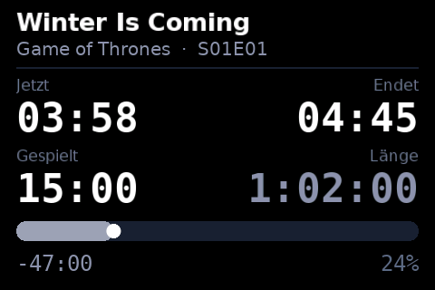
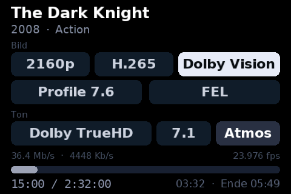
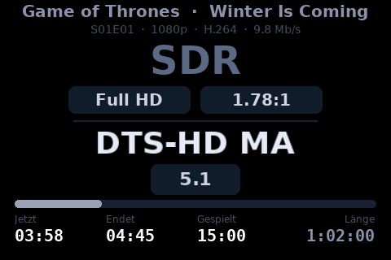

# Layouts

A layout is a JSON file saying **what** appears **where** on the panel. This
covers the bundled ones, the editor that builds them with a mouse, and the
full reference for writing your own.

**Contents:** [Bundled layouts](#bundled-layouts) ·
[The browser editor](#the-browser-editor) ·
[Writing your own](#writing-your-own) · [Skeleton](#skeleton) ·
[Pages](#pages) · [Widget basics](#widget-basics) · [Widgets](#widgets) ·
[Data fields](#data-fields) · [Filters](#filters) ·
[Conditions](#conditions) · [Practical notes](#practical-notes)

---

## Bundled layouts

You select a name — `default.json` — and the add-on loads the size that fits
the attached panel, so `default-800x480.json` on an SPF-87H and
`default-1024x600.json` on an SPF-107H.

**Detailed — for sitting in front of it**

| File | What it shows |
|---|---|
| `default.json` | Four pages: music with cover, video with poster, clock, system |
| | The video page shows the clearlogo in place of the title where there is one (for a film — a series keeps the episode title above its show name), and names the stream below it: resolution, codec, dynamic range, the Dolby Vision profile with its enhancement layer, and the live video and audio bitrate |
| `bigcover.json` | Full-screen cover with an info bar along the bottom |
| `minimal.json` | Large type, segmented bar, no images — the cheapest layout |
| `dashboard.json` | Analogue clock, CPU, temperature, RAM and a history graph |

**XL — readable from across the room**

Little content, very large type, black background, strong colours. On a 3.5"
panel this is the difference between "I would have to get up" and "I can read
that from the sofa".

| File | What it shows |
|---|---|
| `xl-player.json` | Title at 40 px over two lines, artist or show below, thick bar, times at 38 px |
| `xl-remaining.json` | **Remaining time, huge** (96 px) in the middle — the one number you want during a film — plus end time and bar |
| `xl-clock.json` | Time at 128 px; date and CPU while idle, title and bar while playing |
| `xl-system.json` | Big clock over CPU, temperature and RAM as three large numbers with bars |
| `xl-times.json` | **The four clocks** at 44 px: the time now, the time it ends, elapsed and total length, over a thick bar |
| `xl-badges.json` | The running stream as badges: resolution, codec and dynamic range, the Dolby Vision profile with its enhancement layer, then audio codec, channel layout and object audio — with the four times along the foot |
| `xl-hdr.json` | The dynamic range spelled out huge, profile and enhancement layer below it, then the audio codec with channels and object audio — the four times along the foot. Without Dolby Vision the row names the picture instead: `Full HD`, `1.78:1` |
| `cover-full.json` | Just the cover, filling the frame, slim info bar at the bottom |







**Styles** — same information, different look

| File | What it shows |
|---|---|
| `light.json` | Dark text on white — much easier on the eye in a bright room |
| `terminal.json` | Green on black, monospace throughout, segmented bars |
| `neon.json` | Magenta and cyan with a glowing outline, gradient bars |
| `vinyl.json` | The cover as a record complete with centre hole, text beside it |


**Other content**

| File | What it shows |
|---|---|
| `nextup.json` | Current track on top, **what comes next** below — for playlists |
| `weather.json` | Clock and weather side by side, CPU and RAM below. The weather page only appears when Kodi has a weather add-on set up |
| `library.json` | Movies, shows and albums as big counters, episodes and artists below |
| `portrait.json` | **Portrait 320×480** for a panel mounted on its side — cover on top, text below |


Every design exists as `-800x480` and `-1024x600` as well (portrait as
`portrait-480x800.json` and `portrait-600x1024.json`). For portrait, also set
*Display → Picture → Rotation* to 90 or 270 degrees.

All of them in all three playback states:


```sh
python3 tools/contact_sheet.py --state video --out overview.png
# --state: video | series | normal | music | idle
# --all-sizes includes the 800x480 and 1024x600 variants
```

---

## The browser editor

Assembling a layout with the mouse beats typing JSON. The service carries a
small web server that serves an editor.


*Add-ons → LCD4Linux → Web editor* shows the address, usually
`http://<box-ip>:8050/`. It runs in any current browser, phone and tablet
included, and loads nothing from the internet.

* **Pages**: create, copy, reorder, delete — the tabs top left.
* **Elements**: drag from the palette or click to place — text, image,
  progress bar, graph, rectangle, line, circle, icon, analogue clock.
* **Move and resize** with the mouse, snapping to the grid. `Alt` disables
  snapping, `Shift` constrains direction, arrow keys nudge by a pixel and with
  `Shift` by ten.
* **Properties** on the right: every field the renderer knows, with colour
  pickers, font lists and condition templates.
* **Data fields** behind the `${}` button: every token explained, plus the
  filters, inserted at the cursor.
* **Preview**: the add-on renders each change itself, so you see exactly what
  the panel will show — switchable between music, video, paused, idle and, on
  the box, live data.
* **Save** writes to your layout folder; *To the display* applies it at once.
* Undo/redo (`Ctrl+Z` / `Ctrl+Y`), duplicate (`Ctrl+D`), save (`Ctrl+S`),
  delete (`Del`), alignment buttons, and a JSON view for the finishing touches.

It always saves into your own folder, never over a bundled layout: your copy
wins, and deleting it brings the original back.

On a PC without Kodi:

```sh
python3 tools/webeditor.py            # http://127.0.0.1:8050/
python3 tools/webeditor.py --bind all --port 8050 --password secret
```

**Security.** The editor may write layout files and reload the service. That is
the point on a home network; on a shared one set *Reachable from* to **this box
only** or set a password. Only files from `resources/web/` are served, saving
only ever goes to the layout folder, and file names containing path components
are rejected.

---

## Writing your own

Layouts live in

```
/storage/.kodi/userdata/addon_data/script.lcd4linux/layouts/
```

Files there take precedence over the bundled ones and survive updates — your
own `default.json` overrides the template without an update deleting it. On
first start the add-on drops `custom.json.example` there as a starting point.
After editing, choose *Reload service* from the menu.

Files are read as UTF-8 (a byte order mark is tolerated), and lines starting
with `//` or `#` are skipped as comments.

Your own layouts get a picture in the chooser too: rendered once when the list
is first opened, cached in `addon_data/script.lcd4linux/thumbs/`, and re-made
whenever you edit the file.

### Sizes

`size` must match the display. The add-on looks for a matching variant
alongside the file you selected:

| Panel | File name |
|---|---|
| AX206 480×320 | `mine.json` |
| SPF 800×480 | `mine-800x480.json` |
| SPF 1024×600 | `mine-1024x600.json` |

No need to redo it by hand:

```sh
python3 tools/scale_layout.py mine.json 1024 600
```

Positions and boxes scale per axis, font sizes and radii follow the vertical
one. An exactly square box stays square — otherwise the record in `vinyl`
would turn into an ellipse going from 800×480 to 1024×600, where the axes
differ by 1.28 and 1.25.

### Skeleton

```json
{
  "name": "My layout",
  "size": [480, 320],
  "background": "#0b0d12",
  "accent": "auto:${player.thumb}",
  "pageinterval": 15,
  "defaults": {"font": "sans", "size": 18, "color": "#f2f5fa"},
  "pages": [ ... ]
}
```

| Field | Meaning |
|---|---|
| `name` | Shown in the layout chooser |
| `size` | `[width, height]` in pixels |
| `background` | Background colour of the whole layout |
| `accent` | A fixed colour, or `auto:${...}` to pull the most striking colour out of that image — usually the cover. Widgets then use `"color": "accent"` |
| `pageinterval` | Seconds per page, for pages without their own `duration` |
| `defaults` | Default `font`, `size` and `color` for text |
| `pages` | The list of pages |

### Pages

```json
{
  "name": "Music",
  "condition": "audio",
  "duration": 0,
  "priority": 10,
  "background": "#0b0d12",
  "backgroundimage": "${player.thumb}",
  "backgrounddim": 88,
  "widgets": [ ... ]
}
```

| Field | Meaning |
|---|---|
| `name` | Briefly shown as a banner when the page changes |
| `condition` | When the page is eligible, see [Conditions](#conditions). Without one it always is |
| `duration` | Seconds to show it; `0` uses the layout's `pageinterval` |
| `priority` | Higher wins: while any `priority: 10` page is visible, lower ones are ignored. That is how a playback page hides the clock page |
| `background` | Background colour for this page |
| `backgroundimage` | Background image (path or token), cropped to fill |
| `backgrounddim` | 0–100%, how far that image is darkened |
| `widgets` | In drawing order — later ones sit on top |

When several pages qualify at once the add-on cycles through them, restarting
at the first whenever the set changes (playback starting, for instance).

### Widget basics

Every widget shares these:

| Field | Meaning |
|---|---|
| `type` | Which widget, see below |
| `name` | Free text, only used in debug logging |
| `x`, `y` | Top-left corner |
| `w` / `width`, `h` / `height` | Size; without it the widget runs to the right or bottom edge |
| `condition` / `visible` | See [Conditions](#conditions) |
| `opacity` | 0–100% |

**Positions** can be plain numbers (`"x": 20`), percentages of the display
(`"x": "50%"`), or negative to measure from the far edge (`"x": -100` from the
right, `"y": -40` from the bottom).

**Colours** can be `"#RRGGBB"`, `"#AARRGGBB"` with alpha exactly as Kodi skins
write it, the `"#RGB"` short form, `"r,g,b"` or `"r,g,b,a"`, `"accent"` for the
layout accent, or a name: `black`, `white`, `red`, `green`, `blue`, `cyan`,
`magenta`, `yellow`, `orange`, `grey`, `silver`, `dimgrey`, `purple`, `pink`,
`lime`, `teal`, `brown`, `navy`, `gold`, `kodiblue`, `transparent`. Colours may
contain tokens.

**Fonts** are `sans`, `sans-bold`, `mono`, `mono-bold` at any pixel size; sizes
that are not bundled are resampled from the nearest one. Extra `.l4f` fonts go
in a `fonts` folder next to `layouts` (build them with `tools/mkfont.py`).

### Widgets

Nine types: [`text`](#text), [`progress`](#progress), [`graph`](#graph),
[`rect`](#rect), [`line`](#line), [`circle`](#circle), [`image`](#image),
[`icon`](#icon), [`analogclock`](#analogclock).

#### `text`

```json
{"type": "text", "x": 20, "y": 24, "w": 440, "h": 34,
 "text": "${player.title}", "size": 26, "bold": true,
 "align": "center", "scroll": "marquee", "shadow": "#000000"}
```

| Field | Default | Meaning |
|---|---|---|
| `text` | – | The text, with `${...}` tokens |
| `font` | `defaults.font` | Font family |
| `size` | `defaults.size` | Pixel size |
| `bold` | `false` | Appends `-bold` to the family |
| `color` | `defaults.color` | Text colour |
| `align` | `left` | `left`, `center`, `right` |
| `valign` | `top` | `top`, `middle`/`center`, `bottom` |
| `wrap` | `false` | Word wrap within the width |
| `lines` | automatic | Maximum wrapped lines |
| `linespacing` | `0` | Extra leading |
| `padding` | `0` | Inner padding |
| `background` | – | Colour behind the text |
| `radius` | `0` | Corner radius of that background |
| `scroll` | `none` | `marquee` (endless) or `bounce` (back and forth) |
| `scrollspeed` | `30` | Pixels per second |
| `scrollpause` | `2.0` | Pause at each end, for `bounce` |
| `scrollgap` | `40` | Gap between repeats, for `marquee` |
| `shadow` | – | Shadow colour, or `true` |
| `shadowoffset` | `2` | Shadow offset |
| `outline` | – | Outline colour |
| `showempty` | `false` | Draw even when the text is empty |

Text that does not fit is shortened with `…` unless it scrolls.

#### `progress`

```json
{"type": "progress", "x": 20, "y": 260, "w": 440, "h": 12,
 "value": "${player.percent}", "radius": 6, "color": "accent",
 "background": "#1e2330", "knob": true}
```

| Field | Default | Meaning |
|---|---|---|
| `value` | `${player.percent}` | A number or a token |
| `min`, `max` | `0`, `100` | Range |
| `orientation` | `horizontal` | `horizontal` or `vertical` (fills upwards) |
| `color` | Kodi blue | Colour of the filled part |
| `gradient` | – | Second colour for a gradient |
| `background` | `#20242e` | Track colour, `null` for none |
| `radius` | `0` | Corner radius |
| `border`, `bordercolor` | `0` | Border width and colour |
| `style` | `bar` | `bar` or `segments` |
| `segments` | `20` | Segment count for `style: segments` |
| `gap` | `2` | Gap between segments |
| `inactivecolor` | – | Colour of segments not yet reached |
| `knob` | `false` | Knob at the current position |
| `knobsize`, `knobcolor` | | Its size and colour |

#### `graph`

A rolling sparkline of a numeric value.

| Field | Default | Meaning |
|---|---|---|
| `value` | – | Token producing a number |
| `min`, `max` | `0`, `100` | Range |
| `points` | `60` | Samples kept |
| `interval` | `1.0` | Seconds between samples |
| `color` | Kodi blue | Line colour |
| `fill` | – | Fill under the line — use alpha, e.g. `#2217b2e2` |
| `background` | – | Background colour |
| `thickness` | `1` | Line width |

#### `rect`

| Field | Meaning |
|---|---|
| `color` / `fill` | Fill colour |
| `gradient` | Target colour of a gradient |
| `direction` | `vertical` (default) or `horizontal` |
| `radius` | Corner radius |
| `border`, `bordercolor` | Border |

#### `line`

| Field | Meaning |
|---|---|
| `color` | Colour |
| `thickness` | Width |
| `x2`, `y2` | End point, for a diagonal |

Without `x2`/`y2` the line fills its own box: a wide flat box is a horizontal
rule as thick as the box (`"w": 440, "h": 3` is 3 px tall), a tall narrow one a
vertical rule. `thickness` only raises that minimum.

#### `circle`

| Field | Meaning |
|---|---|
| `color` | Colour |
| `radius` | Radius; defaults to half the widget size |
| `thickness` | `0` fills it, otherwise the ring width |

#### `image`

```json
{"type": "image", "x": 18, "y": 18, "w": 180, "h": 180,
 "src": "${player.thumb}", "fit": "cover", "radius": 10}
```

| Field | Default | Meaning |
|---|---|---|
| `src` / `path` | – | File path or token; Kodi `image://` URLs are resolved |
| `fallback` | – | Used when `src` is empty |
| `fit` | `contain` | `contain`, `cover` (fills and crops), `stretch` |
| `radius` | `0` | Rounded corners |
| `align`, `valign` | `center` | Alignment inside the box |
| `opacity` | `100` | Opacity |

PNG and baseline JPEG only — progressive JPEG is not supported. Images are
cached and decoded again only when the source changes.

#### `icon`

Vector icons, scalable and tintable.

```json
{"type": "icon", "x": 18, "y": 212, "w": 20, "h": 20, "icon": "play", "color": "accent"}
```

`play`, `pause`, `stop`, `next`, `previous`, `music`, `movie`, `tv`, `speaker`,
`mute`, `clock`, `cpu`, `temp`, `star`, `heart`, `folder`, `wifi`, `shuffle`,
`repeat`, `disc`, `dot`.

The name may be a token — `"icon": "${player.mediatype}"` with matching icon
names, for instance.

#### `analogclock`

| Field | Default | Meaning |
|---|---|---|
| `face` | – | Dial colour |
| `rim`, `rimwidth` | – | Rim |
| `color` | white | Hour and minute hands |
| `secondcolor` | red | Second hand |
| `ticks` | `true` | Hour ticks |
| `tickcolor` | grey | Tick colour |
| `seconds` | `true` | Show the second hand |

### Data fields

Tokens are written `${...}` and work in text, in numeric fields like `value`,
in colours and in conditions.

**Playback — `player.*`**

| Token | Content |
|---|---|
| `state` | `playing`, `paused`, `stopped` |
| `mediatype` | `audio`, `video`, `picture`, `none` |
| `playing`, `paused` | `1` or `0` |
| `time`, `time_s` | Elapsed, as `m:ss` and in seconds |
| `duration`, `duration_s` | Total length |
| `remaining`, `remaining_s` | Remaining |
| `percent` | Progress 0–100 |
| `title`, `artist`, `albumartist`, `album`, `genre`, `year` | Metadata |
| `track`, `discnumber`, `rating` | Music details |
| `showtitle`, `season`, `episode`, `episodelabel`, `plot` | TV details — `episodelabel` gives `S02E05` |
| `thumb` / `cover` / `art`, `poster`, `fanart`, `clearlogo` | Artwork — `clearlogo` is the transparent logo of the film, the series or the artist |
| `codec` | Codec of the running stream, spelled out: `H.265`, `FLAC` |
| `videocodec`, `audiocodec` | Picture and sound separately |
| `spatial` | Object audio: `Atmos`, `DTS:X`, `IMAX Enhanced`, else empty |
| `audio` | The whole audio line: `Dolby TrueHD Atmos 7.1` |
| `channels` | Speaker layout: `2.0`, `5.1`, `7.1` |
| `channels_count` | Bare count: `6` |
| `bitrate`, `samplerate` | Bitrate and sample rate of a music track, as Kodi reports them |
| `videobitrate`, `audiobitrate` | What is being decoded right now: `24.5 Mb/s`, `1536 Kb/s` — the file's average while nothing live is published |
| `videobitrate_mbps`, `audiobitrate_kbps` | The same without the unit, for a `progress` bar or a `graph` |
| `hdr` | `Dolby Vision`, `HDR10+`, `HDR10`, `HLG`, `SDR` |
| `hdr_short` | The same, abbreviated for a narrow field: `DV` |
| `dv` | The whole Dolby Vision line: `Dolby Vision Profile 7.6 FEL` |
| `dvprofile` | The profile alone: `7.6` |
| `dvprofile_long` | The profile spelled out, without the format name: `Profile 7.6` |
| `dvel` | The enhancement layer: `FEL`, `MEL`, or empty for a single layer stream |
| `resolution` | `2160p`, `1080p`, `576i` — scan type included |
| `resolution_long` | `3840x2160p` |
| `resolutionname` | `4K UHD`, `Full HD`, `HD`, `SD` |
| `videowidth`, `videoheight`, `fps` | Raw values |
| `video` | The whole video line: `H.265 2160p Dolby Vision` |
| `aspect` | Aspect ratio |
| `codec_raw`, `videocodec_raw`, `audiocodec_raw`, `hdr_raw` | The ids as Kodi hands them over: `hevc`, `truehd_atmos` |
| `next`, `nextartist` | What comes next |
| `playlistposition`, `playlistlength` | Position in the playlist |
| `starttime`, `finishtime` | Wall-clock start and end |
| `filename`, `path` | File and folder |
| `speed`, `seeking` | Play speed, seeking |

Anything not in the list is read as the Kodi InfoLabel `Player.<name>`.

`dvprofile` and `dvel` read the Dolby Vision metadata out of the bitstream
itself, which needs CoreELEC 22 on Amlogic (it publishes the raw side data of
the stream being decoded) and the optional add-on `script.module.sidedata` to
parse it. Without the module the profile still comes from Kodi's own
`VideoPlayer.HdrDetail` where the demuxer knew one, and `dvel` stays empty;
nothing else is affected, and `hdr` names Dolby Vision either way.

**System — `system.*`**

`time`, `time12`, `timesec`, `seconds`, `date`, `date_iso`, `date_short`,
`date_long`, `weekday`, `weekday_short`, `day`, `month`, `monthname`, `year`,
`cpu`, `cputemp`, `gputemp`, `memory`, `memoryfree`, `memorytotal`, `uptime`,
`hostname`, `ip`, `kodiversion`, `buildversion`, `freespace`, `volume`,
`muted`, `screensaver`, `profile`.

Temperature and CPU load come straight from `/sys` and `/proc`, so they work on
CoreELEC even when Kodi itself reports nothing.

**Everything else**

| Token | Content |
|---|---|
| `weather.temperature`, `weather.conditions`, `weather.location` | From Kodi's weather add-on |
| `library.songs`, `library.albums`, `library.artists`, `library.movies`, `library.tvshows`, `library.episodes` | Library counts, refreshed every 5 minutes |
| `addon.name`, `addon.version` | This add-on |
| `info:<InfoLabel>` | **Any** Kodi InfoLabel: `${info:MusicPlayer.Album}` |
| `bool:<Condition>` | `1`/`0` for any Kodi boolean condition |

The full list is in the [Kodi wiki](https://kodi.wiki/view/InfoLabels).

### Filters

Append with `|`, chain as needed:

```
${player.title|upper|trunc:20}
${player.time_s|hms}
${player.year|prefix: · }
```

| Filter | Effect |
|---|---|
| `upper`, `lower`, `title`, `capitalize` | Case |
| `strip` | Trim whitespace |
| `trunc:N` | Shorten to N characters with `…` |
| `pad:N` or `pad:N:x` | Right-align to N characters |
| `hms` | Seconds as `m:ss` or `h:mm:ss` |
| `hhmmss` | Seconds always as `h:mm:ss` |
| `int` | Drop decimals |
| `round:N` | Round to N decimals |
| `abs` | Absolute value |
| `default:text` | Replacement when empty |
| `prefix:text` | Prepend, but only when the value is not empty |
| `suffix:text` | Append, likewise |
| `replace:old:new` | Replace |
| `first:sep` | First part; separator defaults to `,` |

`prefix` and `suffix` are how you write separators that vanish when there is
nothing to separate: `${player.year}${player.genre|prefix: · }`.

### Translating fixed words

Write a string id instead of a word, the same spelling Kodi skins use:

```json
{"type": "text", "x": 16, "y": 8, "text": "$LOCALIZE[32433]"}
```

Ids from **30000** up come from this add-on's `resources/language/`; lower ones
from Kodi itself, so `$LOCALIZE[31]` is "Available".

`$LOCALIZE[...]` is substituted **before** `${...}`, so it also works as a
filter argument where `trunc` has to count the translated text:

```
${player.next|prefix:$LOCALIZE[32420]: |trunc:32}
```

A page `name` works the same way. The bundled layouts use this throughout, with
word ids from 32400 up in both language files. Day and month names
(`${system.weekday}`, `${system.monthname}`, `${system.date_long}`) are
translated by the add-on already.

### Conditions

`condition` decides whether a page or a widget is drawn.

| State | True when |
|---|---|
| `playing` | Something is playing |
| `paused` | Playback is paused |
| `stopped` / `idle` | Nothing is playing |
| `active` / `hasmedia` | Playing or paused |
| `audio` | Music is playing or paused |
| `video` | Video is playing or paused |
| `screensaver` | The screensaver is on |
| `always` / `never` | Always / never |

Any Kodi condition works too — `Player.HasVideo`, `System.HasNetwork`,
`Window.IsActive(home)`.

**Comparisons** with `==`, `!=`, `>`, `<`, `>=`, `<=`, ` contains `,
` startswith `, ` endswith `:

```json
"condition": "${player.percent} > 90"
"condition": "${system.cputemp} >= 70"
"condition": "${player.title} contains Live"
```

**Presence** — a bare token is true when it expands to something non-empty:

```json
"condition": "${player.album}"
```

**Combining**: `!` negates, `+` is AND, `|` is OR.

```json
"condition": "video+${player.percent} > 95"
```

---

## Practical notes

### Designing for distance

On a 3.5" panel, font size decides whether anything can be read at all. Rules
of thumb for 480×320:

* Primary information 40–130 px. A title at 40 px reads from two or three
  metres, a clock at 128 px across the room.
* Secondary information not below 20 px — smaller turns into a grey smudge.
* Contrast beats subtlety. Dark grey on near-black (`#4a5266` on `#0b0d12`)
  looks lovely at the desk and vanishes at three metres; use `#a8b0c0`.
* Three to five elements per page. What remains can then be large.
* Thick bars: 18–26 px, not 8–12 px.

The `xl-*` layouts follow all of this and make a good starting point.

### Staying cheap

Text and rectangles cost almost nothing. Images are decoded once when they
change, and a background image is cached after the first frame. Only changes
are transmitted, so a layout without seconds and without scrolling text
produces virtually no USB traffic while idle. On a Samsung frame, large flat
areas are nearly free while a full-screen photo costs the most on the first
frame — see the table in [SETTINGS.md](SETTINGS.md#what-a-frame-costs-on-a-samsung).

### When something is wrong

Errors go to the Kodi log. A widget that raises is skipped and the rest of the
page still draws; invalid JSON makes the add-on fall back to the first layout
it can find.

```sh
python3 tools/preview.py --layout mine.json --page 0 --out test.png
```

The *test pattern* in the menu verifies resolution, rotation and byte order:
the red frame must touch all four edges and the grey wedge must be smooth.
